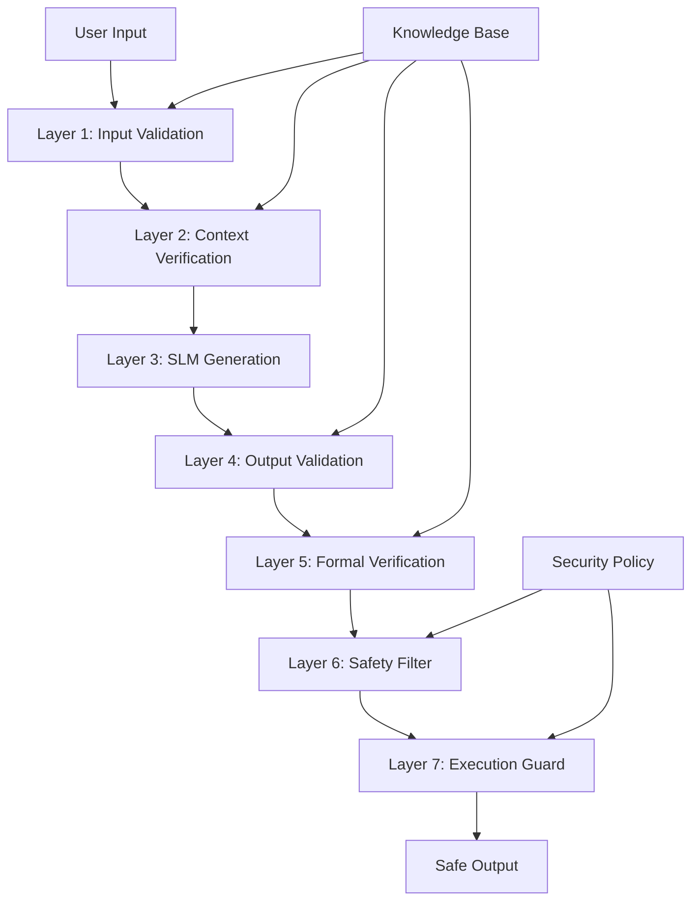

# ハルシネーション防止メカニズム技術詳細仕様書

## Cognos AI統合システムにおける構造的安全性保証

---

## 1. 文書の目的と実装状況

### 1.1 ハルシネーション防止の重要性
本文書は、Cognos AIシステムにおいて「AIが構造的にバグを生成できない」安全性を実現するためのハルシネーション防止メカニズムの詳細技術仕様を定義します。

### 1.2 実装状況の誠実な報告
```yaml
現在の実装状況:
  理論設計: 100% (完了)
  アルゴリズム設計: 90% (ほぼ完了)
  実装: 0% (未着手)
  検証: 0% (未実装のため不可)

実装完了予定:
  基本実装: 4-6週間
  高度な機能: 2-3週間
  検証・最適化: 2週間
  総工数: 8-11週間
```

---

## 2. ハルシネーション問題の分析

### 2.1 ハルシネーション分類

#### 2.1.1 Type 1: 事実誤認ハルシネーション
```yaml
定義: 存在しない事実を事実として出力
例:
  - 存在しないファイルパスの生成
  - 無効なシステムコールの出力
  - 存在しない関数・APIの呼び出し

危険度: 高（システム破損リスク）
検出難易度: 中（形式的検証可能）
```

#### 2.1.2 Type 2: 論理的不整合ハルシネーション
```yaml
定義: 論理的に矛盾する内容の出力
例:
  - 同じファイルを同時に読み書きする指示
  - 競合する複数のシステムコール
  - 因果関係が矛盾するコマンドシーケンス

危険度: 高（競合状態・デッドロック）
検出難易度: 高（複雑な論理検証が必要）
```

#### 2.1.3 Type 3: コンテキスト逸脱ハルシネーション
```yaml
定義: 与えられたコンテキストから逸脱した出力
例:
  - 質問とは無関係な回答
  - 権限を超えたシステム操作の提案
  - スコープ外のリソースへのアクセス

危険度: 中（意図しない操作実行）
検出難易度: 中（コンテキスト分析で検出可能）
```

#### 2.1.4 Type 4: 有害コンテンツハルシネーション
```yaml
定義: 悪意のある・有害なコンテンツの出力
例:
  - システム破壊コマンドの生成
  - セキュリティホールを狙った攻撃コード
  - 機密情報の漏洩を狙ったクエリ

危険度: 極高（システム侵害リスク）
検出難易度: 高（文脈的判断が必要）
```

### 2.2 ハルシネーション発生メカニズム

#### 2.2.1 統計的言語モデルの限界
```yaml
原因1: 訓練データの偏り
  - 不正確な情報を含む訓練データ
  - ドメイン外知識の不足
  - 時代遅れの情報

原因2: 確率的生成の性質
  - 次トークン予測の不確実性
  - 低確率だが可能性のある誤答
  - ランダムサンプリングによる誤差

原因3: コンテキスト制限
  - 有限のコンテキスト長
  - 長期依存関係の捕捉困難
  - 複雑な論理推論の限界
```

#### 2.2.2 Cognosにおける特有リスク
```yaml
システムコール生成リスク:
  - 無効なシステムコール生成
  - 危険な引数の指定
  - 権限昇格の試行

カーネル統合リスク:
  - カーネルパニックを誘発するコード
  - メモリ破損を起こす操作
  - 無限ループ・デッドロックの生成

自然言語理解リスク:
  - 意図の誤解釈
  - 曖昧な指示の誤った具体化
  - 暗黙的制約の無視
```

---

## 3. 多層防御アーキテクチャ

### 3.1 防御レイヤー構成



### 3.2 各レイヤー詳細仕様

#### 3.2.1 Layer 1: Input Validation（入力検証）
```rust
// 設計段階 - 実装未完了
pub struct InputValidator {
    // 許可されたコマンドパターン
    allowed_patterns: Vec<InputPattern>,
    
    // 禁止されたキーワード
    forbidden_keywords: HashSet<String>,
    
    // 長さ制限
    max_input_length: usize,
    
    // 文字集合制限
    allowed_charset: CharsetValidator,
}

#[derive(Debug, Clone)]
pub struct InputPattern {
    pattern: regex::Regex,
    category: InputCategory,
    risk_level: RiskLevel,
    required_permissions: Vec<Permission>,
}

#[derive(Debug, Clone, PartialEq)]
pub enum InputCategory {
    FileOperation,
    ProcessManagement,
    NetworkAccess,
    SystemInformation,
    Configuration,
    Custom(String),
}

impl InputValidator {
    // 設計段階 - 実装未完了
    pub fn validate(&self, input: &str) -> Result<ValidatedInput, ValidationError> {
        // 1. 基本形式チェック
        self.check_basic_format(input)?;
        
        // 2. 禁止キーワードチェック
        self.check_forbidden_keywords(input)?;
        
        // 3. パターンマッチング
        let matched_patterns = self.match_patterns(input)?;
        
        // 4. リスクレベル評価
        let risk_level = self.calculate_risk_level(&matched_patterns);
        
        // 5. 権限チェック
        self.check_permissions(&matched_patterns)?;
        
        Ok(ValidatedInput {
            original: input.to_string(),
            patterns: matched_patterns,
            risk_level,
            sanitized: self.sanitize_input(input),
        })
    }
    
    fn check_forbidden_keywords(&self, input: &str) -> Result<(), ValidationError> {
        for keyword in &self.forbidden_keywords {
            if input.to_lowercase().contains(keyword) {
                return Err(ValidationError::ForbiddenKeyword {
                    keyword: keyword.clone(),
                    context: input.to_string(),
                });
            }
        }
        Ok(())
    }
}
```

#### 3.2.2 Layer 2: Context Verification（コンテキスト検証）
```rust
// 設計段階 - 実装未完了
pub struct ContextVerifier {
    // システム状態
    system_state: SystemState,
    
    // 権限コンテキスト
    permission_context: PermissionContext,
    
    // 履歴コンテキスト
    history_context: HistoryContext,
    
    // 制約ルール
    constraint_rules: Vec<ContextConstraint>,
}

#[derive(Debug, Clone)]
pub struct SystemState {
    // ファイルシステム状態
    filesystem_state: FilesystemState,
    
    // プロセス状態
    process_state: ProcessState,
    
    // ネットワーク状態
    network_state: NetworkState,
    
    // リソース使用状況
    resource_usage: ResourceUsage,
}

impl ContextVerifier {
    // 設計段階 - 実装未完了
    pub fn verify_context(&self, input: &ValidatedInput) -> Result<ContextualInput, ContextError> {
        // 1. システム状態整合性チェック
        self.verify_system_state_consistency(input)?;
        
        // 2. 権限コンテキスト確認
        self.verify_permission_context(input)?;
        
        // 3. 履歴コンテキスト分析
        self.analyze_history_context(input)?;
        
        // 4. 制約ルール適用
        let constraints = self.apply_constraint_rules(input)?;
        
        Ok(ContextualInput {
            validated_input: input.clone(),
            system_context: self.system_state.clone(),
            applicable_constraints: constraints,
            context_confidence: self.calculate_context_confidence(input),
        })
    }
    
    fn verify_system_state_consistency(&self, input: &ValidatedInput) -> Result<(), ContextError> {
        // ファイル存在性チェック
        for pattern in &input.patterns {
            if let Some(file_path) = pattern.extract_file_path() {
                if !self.system_state.filesystem_state.file_exists(&file_path) {
                    return Err(ContextError::FileNotFound { path: file_path });
                }
            }
        }
        
        // プロセス状態チェック
        // ネットワーク状態チェック
        // リソース利用可能性チェック
        
        Ok(())
    }
}
```

#### 3.2.3 Layer 4: Output Validation（出力検証）
```rust
// 設計段階 - 実装未完了
pub struct OutputValidator {
    // 有効性ルール
    validity_rules: Vec<ValidityRule>,
    
    // 安全性ルール
    safety_rules: Vec<SafetyRule>,
    
    // 形式検証器
    format_verifiers: HashMap<OutputType, FormatVerifier>,
    
    // 既知の安全パターン
    safe_patterns: Vec<SafePattern>,
}

#[derive(Debug, Clone)]
pub enum ValidityRule {
    SystemCallExists { syscall: String },
    ArgumentValid { syscall: String, arg_index: usize, validator: ArgumentValidator },
    FilePathValid { path_pattern: String },
    PermissionRequired { operation: String, permission: Permission },
}

#[derive(Debug, Clone)]
pub enum SafetyRule {
    NoDestructiveOperations,
    NoPrivilegeEscalation,
    NoArbitraryCodeExecution,
    NoSensitiveDataAccess,
    NoNetworkExposure,
    Custom(String, Box<dyn Fn(&str) -> bool>),
}

impl OutputValidator {
    // 設計段階 - 実装未完了
    pub fn validate_output(&self, 
        output: &str, 
        context: &ContextualInput
    ) -> Result<ValidatedOutput, OutputValidationError> {
        
        // 1. 形式検証
        let parsed_output = self.parse_and_validate_format(output)?;
        
        // 2. 有効性検証
        self.validate_validity(&parsed_output, context)?;
        
        // 3. 安全性検証
        self.validate_safety(&parsed_output, context)?;
        
        // 4. 安全パターンマッチング
        let safety_score = self.calculate_safety_score(&parsed_output);
        
        // 5. 信頼度計算
        let confidence = self.calculate_output_confidence(&parsed_output, context);
        
        Ok(ValidatedOutput {
            original: output.to_string(),
            parsed: parsed_output,
            safety_score,
            confidence,
            validation_metadata: self.create_metadata(output, context),
        })
    }
    
    fn validate_validity(&self, 
        output: &ParsedOutput, 
        context: &ContextualInput
    ) -> Result<(), OutputValidationError> {
        
        for rule in &self.validity_rules {
            match rule {
                ValidityRule::SystemCallExists { syscall } => {
                    if !self.syscall_exists(syscall) {
                        return Err(OutputValidationError::InvalidSystemCall { 
                            syscall: syscall.clone() 
                        });
                    }
                },
                ValidityRule::ArgumentValid { syscall, arg_index, validator } => {
                    if let Some(args) = output.get_syscall_args(syscall) {
                        if let Some(arg) = args.get(*arg_index) {
                            if !validator.validate(arg) {
                                return Err(OutputValidationError::InvalidArgument {
                                    syscall: syscall.clone(),
                                    arg_index: *arg_index,
                                    arg: arg.clone(),
                                });
                            }
                        }
                    }
                },
                // 他のルール処理...
            }
        }
        
        Ok(())
    }
}
```

#### 3.2.4 Layer 5: Formal Verification（形式検証）
```rust
// 設計段階 - 実装未完了
pub struct FormalVerifier {
    // SMTソルバー（Z3等）
    smt_solver: SmtSolver,
    
    // 形式仕様
    formal_specs: Vec<FormalSpecification>,
    
    // 検証ルール
    verification_rules: Vec<VerificationRule>,
    
    // 制約データベース
    constraint_db: ConstraintDatabase,
}

#[derive(Debug, Clone)]
pub struct FormalSpecification {
    name: String,
    preconditions: Vec<LogicalFormula>,
    postconditions: Vec<LogicalFormula>,
    invariants: Vec<LogicalFormula>,
}

#[derive(Debug, Clone)]
pub enum LogicalFormula {
    Predicate { name: String, args: Vec<Term> },
    And(Box<LogicalFormula>, Box<LogicalFormula>),
    Or(Box<LogicalFormula>, Box<LogicalFormula>),
    Not(Box<LogicalFormula>),
    Implies(Box<LogicalFormula>, Box<LogicalFormula>),
    Forall { var: String, formula: Box<LogicalFormula> },
    Exists { var: String, formula: Box<LogicalFormula> },
}

impl FormalVerifier {
    // 設計段階 - 実装未完了
    pub fn verify_formally(&self, 
        output: &ValidatedOutput,
        context: &ContextualInput
    ) -> Result<FormalVerificationResult, VerificationError> {
        
        // 1. 出力を論理式に変換
        let logical_representation = self.convert_to_logic(output)?;
        
        // 2. 前提条件の設定
        let preconditions = self.extract_preconditions(context)?;
        
        // 3. 各仕様に対する検証
        let mut verification_results = Vec::new();
        
        for spec in &self.formal_specs {
            let result = self.verify_specification(
                &logical_representation,
                &preconditions,
                spec
            )?;
            verification_results.push(result);
        }
        
        // 4. 全体的な検証結果の統合
        let overall_result = self.combine_verification_results(&verification_results);
        
        Ok(FormalVerificationResult {
            individual_results: verification_results,
            overall_result,
            proof_trace: self.extract_proof_trace(),
            counterexamples: self.extract_counterexamples(),
        })
    }
    
    fn verify_specification(&self,
        logic: &LogicalRepresentation,
        preconditions: &[LogicalFormula],
        spec: &FormalSpecification
    ) -> Result<SpecificationResult, VerificationError> {
        
        // SMTソルバーによる検証
        let mut solver_context = self.smt_solver.create_context();
        
        // 前提条件を追加
        for precondition in preconditions {
            solver_context.assert(precondition);
        }
        
        // 仕様の前提条件を追加
        for precondition in &spec.preconditions {
            solver_context.assert(precondition);
        }
        
        // 出力ロジックを追加
        solver_context.assert(&logic.formula);
        
        // 事後条件の否定を追加（反例探索）
        for postcondition in &spec.postconditions {
            let negated = LogicalFormula::Not(Box::new(postcondition.clone()));
            let satisfiability = solver_context.check_satisfiability(&negated);
            
            if satisfiability == Satisfiable {
                // 事後条件が満たされない場合がある
                return Ok(SpecificationResult::Failed {
                    spec_name: spec.name.clone(),
                    counterexample: solver_context.get_model(),
                });
            }
        }
        
        Ok(SpecificationResult::Passed {
            spec_name: spec.name.clone(),
        })
    }
}
```

---

## 4. 信頼度計算アルゴリズム

### 4.1 多次元信頼度モデル

#### 4.1.1 信頼度コンポーネント
```rust
// 設計段階 - 実装未完了
#[derive(Debug, Clone)]
pub struct ConfidenceCalculator {
    // 各次元の重み
    weights: ConfidenceWeights,
    
    // 履歴データ
    historical_accuracy: HistoricalAccuracy,
    
    // 校正パラメータ
    calibration_params: CalibrationParameters,
}

#[derive(Debug, Clone)]
pub struct ConfidenceWeights {
    model_confidence: f32,      // 0.3
    validation_score: f32,      // 0.25
    context_consistency: f32,   // 0.2
    formal_verification: f32,   // 0.15
    historical_accuracy: f32,   // 0.1
}

#[derive(Debug, Clone)]
pub struct MultiDimensionalConfidence {
    // モデル内在信頼度
    model_confidence: f32,
    
    // 検証信頼度
    validation_confidence: f32,
    
    // コンテキスト一貫性
    context_consistency: f32,
    
    // 形式検証信頼度
    formal_verification_confidence: f32,
    
    // 履歴精度信頼度
    historical_confidence: f32,
    
    // 統合信頼度
    overall_confidence: f32,
}
```

#### 4.1.2 信頼度計算式
```rust
impl ConfidenceCalculator {
    // 設計段階 - 実装未完了
    pub fn calculate_confidence(&self,
        output: &ValidatedOutput,
        context: &ContextualInput,
        verification_result: &FormalVerificationResult
    ) -> MultiDimensionalConfidence {
        
        // 1. モデル内在信頼度（アテンション重みベース）
        let model_conf = self.calculate_model_confidence(output);
        
        // 2. 検証信頼度（バリデーション結果ベース）
        let validation_conf = self.calculate_validation_confidence(output);
        
        // 3. コンテキスト一貫性（状態整合性ベース）
        let context_conf = self.calculate_context_consistency(output, context);
        
        // 4. 形式検証信頼度（証明強度ベース）
        let formal_conf = self.calculate_formal_verification_confidence(verification_result);
        
        // 5. 履歴精度信頼度（過去の成功率ベース）
        let historical_conf = self.calculate_historical_confidence(output, context);
        
        // 6. 統合信頼度（重み付き平均）
        let overall_conf = self.calculate_overall_confidence(
            model_conf,
            validation_conf, 
            context_conf,
            formal_conf,
            historical_conf
        );
        
        MultiDimensionalConfidence {
            model_confidence: model_conf,
            validation_confidence: validation_conf,
            context_consistency: context_conf,
            formal_verification_confidence: formal_conf,
            historical_confidence: historical_conf,
            overall_confidence: overall_conf,
        }
    }
    
    fn calculate_model_confidence(&self, output: &ValidatedOutput) -> f32 {
        // アテンション重みの分析
        let attention_entropy = self.calculate_attention_entropy(output);
        let token_probabilities = self.extract_token_probabilities(output);
        
        // 信頼度計算式
        let prob_confidence = self.geometric_mean(&token_probabilities);
        let attention_confidence = 1.0 - (attention_entropy / self.max_entropy());
        
        // 重み付き平均
        0.6 * prob_confidence + 0.4 * attention_confidence
    }
    
    fn calculate_validation_confidence(&self, output: &ValidatedOutput) -> f32 {
        // バリデーション通過率
        let validation_score = output.safety_score;
        
        // 検証項目数による重み付け
        let num_validations = output.validation_metadata.num_checks;
        let coverage_bonus = (num_validations as f32 / 10.0).min(1.0) * 0.1;
        
        validation_score + coverage_bonus
    }
    
    fn calculate_overall_confidence(&self,
        model: f32, validation: f32, context: f32, 
        formal: f32, historical: f32
    ) -> f32 {
        let w = &self.weights;
        
        let weighted_sum = 
            w.model_confidence * model +
            w.validation_score * validation +
            w.context_consistency * context +
            w.formal_verification * formal +
            w.historical_accuracy * historical;
        
        // 校正関数適用
        self.apply_calibration(weighted_sum)
    }
    
    fn apply_calibration(&self, raw_confidence: f32) -> f32 {
        // Platt校正またはIsotonic校正
        let params = &self.calibration_params;
        
        // シグモイド校正
        let calibrated = 1.0 / (1.0 + (-params.a * raw_confidence + params.b).exp());
        
        calibrated.clamp(0.0, 1.0)
    }
}
```

### 4.2 動的信頼度調整

#### 4.2.1 オンライン学習による校正
```rust
// 設計段階 - 実装未完了
pub struct DynamicConfidenceCalibrator {
    // 校正履歴
    calibration_history: VecDeque<CalibrationPoint>,
    
    // 最適化器
    optimizer: ConfidenceOptimizer,
    
    // 更新パラメータ
    learning_rate: f32,
    decay_factor: f32,
}

#[derive(Debug, Clone)]
pub struct CalibrationPoint {
    predicted_confidence: f32,
    actual_correctness: bool,
    context_features: Vec<f32>,
    timestamp: std::time::SystemTime,
}

impl DynamicConfidenceCalibrator {
    // 設計段階 - 実装未完了
    pub fn update_calibration(&mut self, 
        predicted_confidence: f32,
        actual_correctness: bool,
        context: &ContextualInput
    ) {
        // 1. 新しい校正ポイント作成
        let calibration_point = CalibrationPoint {
            predicted_confidence,
            actual_correctness,
            context_features: self.extract_context_features(context),
            timestamp: std::time::SystemTime::now(),
        };
        
        // 2. 履歴に追加
        self.calibration_history.push_back(calibration_point);
        
        // 3. 古いデータの削除
        if self.calibration_history.len() > 1000 {
            self.calibration_history.pop_front();
        }
        
        // 4. 校正パラメータの更新
        self.update_calibration_parameters();
    }
    
    fn update_calibration_parameters(&mut self) {
        if self.calibration_history.len() < 10 {
            return; // データ不足
        }
        
        // ロジスティック回帰による校正パラメータ最適化
        let (features, labels): (Vec<_>, Vec<_>) = self.calibration_history
            .iter()
            .map(|point| (
                point.predicted_confidence,
                if point.actual_correctness { 1.0 } else { 0.0 }
            ))
            .unzip();
        
        // 勾配降下法による最適化
        self.optimizer.optimize(&features, &labels);
    }
}
```

---

## 5. テンプレートベース安全制約

### 5.1 安全テンプレートシステム

#### 5.1.1 テンプレート定義
```rust
// 設計段階 - 実装未完了
pub struct SafetyTemplateSystem {
    // 事前検証済みテンプレート
    verified_templates: HashMap<TemplateId, SafetyTemplate>,
    
    // テンプレートマッチャー
    template_matcher: TemplateMatcher,
    
    // 安全性証明
    safety_proofs: HashMap<TemplateId, SafetyProof>,
}

#[derive(Debug, Clone)]
pub struct SafetyTemplate {
    id: TemplateId,
    name: String,
    
    // テンプレートパターン
    input_pattern: InputPattern,
    output_template: OutputTemplate,
    
    // 安全性制約
    safety_constraints: Vec<SafetyConstraint>,
    
    // 事前条件・事後条件
    preconditions: Vec<LogicalFormula>,
    postconditions: Vec<LogicalFormula>,
    
    // 検証済みフラグ
    is_verified: bool,
    verification_timestamp: std::time::SystemTime,
}

#[derive(Debug, Clone)]
pub struct OutputTemplate {
    // 固定部分
    fixed_parts: Vec<String>,
    
    // 変数部分
    variable_parts: Vec<TemplateVariable>,
    
    // 構成ルール
    composition_rules: Vec<CompositionRule>,
}

#[derive(Debug, Clone)]
pub struct TemplateVariable {
    name: String,
    var_type: VariableType,
    constraints: Vec<VariableConstraint>,
    default_value: Option<String>,
}

#[derive(Debug, Clone)]
pub enum VariableType {
    FilePath { must_exist: bool, permissions: Vec<Permission> },
    ProcessId { must_be_running: bool },
    Integer { min: i64, max: i64 },
    String { max_length: usize, allowed_chars: CharSet },
    Enum { allowed_values: Vec<String> },
}
```

#### 5.1.2 テンプレートマッチングアルゴリズム
```rust
impl SafetyTemplateSystem {
    // 設計段階 - 実装未完了
    pub fn find_matching_templates(&self, 
        input: &ValidatedInput
    ) -> Vec<(TemplateId, f32)> { // (template_id, match_score)
        
        let mut matches = Vec::new();
        
        for (template_id, template) in &self.verified_templates {
            let match_score = self.calculate_match_score(input, template);
            
            if match_score > 0.7 { // 閾値以上のマッチ
                matches.push((*template_id, match_score));
            }
        }
        
        // スコア順でソート
        matches.sort_by(|a, b| b.1.partial_cmp(&a.1).unwrap());
        
        matches
    }
    
    fn calculate_match_score(&self, 
        input: &ValidatedInput, 
        template: &SafetyTemplate
    ) -> f32 {
        // 1. 構文的類似度
        let syntactic_score = self.calculate_syntactic_similarity(
            &input.sanitized, 
            &template.input_pattern
        );
        
        // 2. 意味的類似度
        let semantic_score = self.calculate_semantic_similarity(
            input, 
            template
        );
        
        // 3. コンテキスト一致度
        let context_score = self.calculate_context_match(
            input, 
            template
        );
        
        // 重み付き平均
        0.4 * syntactic_score + 0.4 * semantic_score + 0.2 * context_score
    }
    
    pub fn instantiate_template(&self,
        template_id: TemplateId,
        input: &ValidatedInput,
        context: &ContextualInput
    ) -> Result<InstantiatedTemplate, TemplateError> {
        
        let template = self.verified_templates.get(&template_id)
            .ok_or(TemplateError::TemplateNotFound)?;
        
        // 1. 変数値の抽出
        let variable_assignments = self.extract_variable_values(input, template)?;
        
        // 2. 制約検証
        self.verify_variable_constraints(&variable_assignments, template)?;
        
        // 3. 事前条件チェック
        self.check_preconditions(&variable_assignments, context, template)?;
        
        // 4. テンプレート実体化
        let instantiated_output = self.instantiate_output_template(
            &template.output_template,
            &variable_assignments
        )?;
        
        Ok(InstantiatedTemplate {
            template_id,
            original_input: input.clone(),
            variable_assignments,
            instantiated_output,
            safety_guarantees: template.safety_constraints.clone(),
        })
    }
}
```

### 5.2 安全性証明システム

#### 5.2.1 証明生成
```rust
// 設計段階 - 実装未完了
pub struct SafetyProofGenerator {
    // 証明データベース
    proof_database: ProofDatabase,
    
    // 証明戦略
    proof_strategies: Vec<ProofStrategy>,
    
    // SMTソルバー
    smt_solver: SmtSolver,
}

#[derive(Debug, Clone)]
pub struct SafetyProof {
    template_id: TemplateId,
    proof_tree: ProofTree,
    verified_properties: Vec<SafetyProperty>,
    proof_timestamp: std::time::SystemTime,
    proof_confidence: f32,
}

#[derive(Debug, Clone)]
pub enum ProofTree {
    Axiom { property: SafetyProperty },
    ModusPonens { 
        premise: Box<ProofTree>, 
        implication: Box<ProofTree> 
    },
    Conjunction { 
        left: Box<ProofTree>, 
        right: Box<ProofTree> 
    },
    Induction { 
        base_case: Box<ProofTree>, 
        inductive_step: Box<ProofTree> 
    },
    SMTProof { 
        formula: LogicalFormula, 
        solver_trace: String 
    },
}

impl SafetyProofGenerator {
    // 設計段階 - 実装未完了
    pub fn generate_proof(&self, 
        template: &SafetyTemplate
    ) -> Result<SafetyProof, ProofError> {
        
        let mut verified_properties = Vec::new();
        let mut proof_trees = Vec::new();
        
        // 各安全性制約に対する証明生成
        for constraint in &template.safety_constraints {
            let property = self.constraint_to_property(constraint);
            let proof_tree = self.prove_property(&property, template)?;
            
            verified_properties.push(property);
            proof_trees.push(proof_tree);
        }
        
        // 証明の統合
        let combined_proof = self.combine_proofs(proof_trees);
        
        Ok(SafetyProof {
            template_id: template.id,
            proof_tree: combined_proof,
            verified_properties,
            proof_timestamp: std::time::SystemTime::now(),
            proof_confidence: self.calculate_proof_confidence(&verified_properties),
        })
    }
    
    fn prove_property(&self, 
        property: &SafetyProperty, 
        template: &SafetyTemplate
    ) -> Result<ProofTree, ProofError> {
        
        // 証明戦略の選択
        for strategy in &self.proof_strategies {
            if strategy.is_applicable(property, template) {
                if let Ok(proof) = strategy.apply(property, template) {
                    return Ok(proof);
                }
            }
        }
        
        // SMTソルバーによる証明
        self.prove_with_smt(property, template)
    }
    
    fn prove_with_smt(&self, 
        property: &SafetyProperty, 
        template: &SafetyTemplate
    ) -> Result<ProofTree, ProofError> {
        
        let mut solver_context = self.smt_solver.create_context();
        
        // テンプレートの制約を追加
        for constraint in &template.safety_constraints {
            let formula = self.constraint_to_formula(constraint);
            solver_context.assert(&formula);
        }
        
        // 事前条件を追加
        for precondition in &template.preconditions {
            solver_context.assert(precondition);
        }
        
        // プロパティの否定を追加（証明のため）
        let negated_property = self.negate_property(property);
        solver_context.assert(&negated_property);
        
        // 充足可能性チェック
        match solver_context.check_satisfiability() {
            Unsatisfiable => {
                // 証明成功
                Ok(ProofTree::SMTProof {
                    formula: self.property_to_formula(property),
                    solver_trace: solver_context.get_proof_trace(),
                })
            },
            Satisfiable => {
                Err(ProofError::PropertyNotProvable {
                    property: property.clone(),
                    counterexample: solver_context.get_model(),
                })
            },
            Unknown => {
                Err(ProofError::ProofTimeout)
            }
        }
    }
}
```

---

## 6. 実行時ガードシステム

### 6.1 実行時監視

#### 6.1.1 リアルタイム異常検出
```rust
// 設計段階 - 実装未完了
pub struct RuntimeGuard {
    // 異常検出器
    anomaly_detectors: Vec<AnomalyDetector>,
    
    // 実行監視
    execution_monitor: ExecutionMonitor,
    
    // 緊急停止メカニズム
    emergency_stop: EmergencyStop,
    
    // ログ・アラート
    logging_system: LoggingSystem,
}

#[derive(Debug, Clone)]
pub struct AnomalyDetector {
    detector_type: DetectorType,
    threshold: f32,
    window_size: usize,
    is_enabled: bool,
}

#[derive(Debug, Clone)]
pub enum DetectorType {
    StatisticalOutlier { method: OutlierMethod },
    SequenceAnomaly { model: SequenceModel },
    ResourceConsumption { resource: ResourceType },
    SecurityViolation { rule: SecurityRule },
    LogicalInconsistency { checker: ConsistencyChecker },
}

impl RuntimeGuard {
    // 設計段階 - 実装未完了
    pub fn monitor_execution(&mut self, 
        command: &str, 
        context: &ContextualInput
    ) -> Result<ExecutionResult, GuardError> {
        
        // 1. 実行前チェック
        self.pre_execution_check(command, context)?;
        
        // 2. 実行開始
        let execution_handle = self.execution_monitor.start_execution(command)?;
        
        // 3. リアルタイム監視
        while !execution_handle.is_complete() {
            // 異常検出
            for detector in &mut self.anomaly_detectors {
                if detector.is_enabled {
                    let anomaly_score = detector.detect_anomaly(&execution_handle)?;
                    
                    if anomaly_score > detector.threshold {
                        // 異常検出時の処理
                        self.handle_anomaly(detector, anomaly_score, &execution_handle)?;
                    }
                }
            }
            
            // 短時間待機
            std::thread::sleep(std::time::Duration::from_millis(10));
        }
        
        // 4. 実行結果の検証
        let result = execution_handle.get_result()?;
        self.post_execution_verification(&result, context)?;
        
        Ok(result)
    }
    
    fn handle_anomaly(&mut self,
        detector: &AnomalyDetector,
        anomaly_score: f32,
        execution_handle: &ExecutionHandle
    ) -> Result<(), GuardError> {
        
        // ログ記録
        self.logging_system.log_anomaly(detector, anomaly_score);
        
        // 異常レベルに応じた対応
        if anomaly_score > 0.9 {
            // 緊急停止
            self.emergency_stop.stop_execution(execution_handle)?;
            return Err(GuardError::EmergencyStop { 
                reason: format!("High anomaly score: {}", anomaly_score) 
            });
        } else if anomaly_score > 0.7 {
            // 警告発行
            self.logging_system.log_warning(format!(
                "Anomaly detected: score={}", anomaly_score
            ));
        }
        
        Ok(())
    }
}
```

### 6.2 サンドボックス実行

#### 6.2.1 セキュアな実行環境
```rust
// 設計段階 - 実装未完了
pub struct SecureSandbox {
    // 権限制限
    permission_manager: PermissionManager,
    
    // リソース制限
    resource_limiter: ResourceLimiter,
    
    // ファイルシステム分離
    filesystem_isolation: FilesystemIsolation,
    
    // ネットワーク分離
    network_isolation: NetworkIsolation,
}

#[derive(Debug, Clone)]
pub struct PermissionManager {
    // 許可された操作
    allowed_operations: HashSet<Operation>,
    
    // 禁止された操作
    forbidden_operations: HashSet<Operation>,
    
    // 条件付き許可
    conditional_permissions: Vec<ConditionalPermission>,
}

impl SecureSandbox {
    // 設計段階 - 実装未完了
    pub fn execute_safely(&self, 
        command: &str, 
        context: &ContextualInput
    ) -> Result<SandboxResult, SandboxError> {
        
        // 1. サンドボックス環境作成
        let sandbox_env = self.create_sandbox_environment(context)?;
        
        // 2. 権限制限適用
        self.permission_manager.apply_restrictions(&sandbox_env)?;
        
        // 3. リソース制限設定
        self.resource_limiter.set_limits(&sandbox_env)?;
        
        // 4. 分離環境での実行
        let result = sandbox_env.execute(command)?;
        
        // 5. 結果の検証と清理
        let verified_result = self.verify_and_cleanup(result, &sandbox_env)?;
        
        Ok(verified_result)
    }
    
    fn create_sandbox_environment(&self, 
        context: &ContextualInput
    ) -> Result<SandboxEnvironment, SandboxError> {
        
        // 1. 一時ディレクトリ作成
        let temp_dir = self.filesystem_isolation.create_temp_directory()?;
        
        // 2. 必要なファイルのコピー
        for file_path in context.get_required_files() {
            self.filesystem_isolation.copy_file_to_sandbox(file_path, &temp_dir)?;
        }
        
        // 3. ネットワーク名前空間作成
        let network_namespace = self.network_isolation.create_namespace()?;
        
        // 4. プロセス名前空間作成
        let process_namespace = ProcessNamespace::new()?;
        
        Ok(SandboxEnvironment {
            temp_directory: temp_dir,
            network_namespace,
            process_namespace,
            start_time: std::time::SystemTime::now(),
        })
    }
}
```

---

## 7. 性能とセキュリティのバランス

### 7.1 最適化戦略

#### 7.1.1 段階的検証
```rust
// 設計段階 - 実装未完了
pub struct TieredValidation {
    // 高速検証（常時実行）
    fast_validators: Vec<FastValidator>,
    
    // 中速検証（高リスク時）
    medium_validators: Vec<MediumValidator>,
    
    // 重検証（最高リスク時）
    thorough_validators: Vec<ThoroughValidator>,
    
    // リスク評価器
    risk_assessor: RiskAssessor,
}

impl TieredValidation {
    // 設計段階 - 実装未完了
    pub fn validate_tiered(&self, 
        output: &str, 
        context: &ContextualInput
    ) -> Result<TieredValidationResult, ValidationError> {
        
        // 1. 初期リスク評価
        let initial_risk = self.risk_assessor.assess_initial_risk(output, context);
        
        // 2. 高速検証（必須）
        let fast_result = self.run_fast_validation(output, context)?;
        
        // 3. リスクレベルに応じた追加検証
        let validation_result = match initial_risk {
            RiskLevel::Low => {
                // 高速検証のみ
                TieredValidationResult {
                    fast_result,
                    medium_result: None,
                    thorough_result: None,
                    total_time_ms: fast_result.validation_time_ms,
                    confidence: fast_result.confidence,
                }
            },
            RiskLevel::Medium => {
                // 高速 + 中速検証
                let medium_result = self.run_medium_validation(output, context)?;
                let combined_confidence = self.combine_confidence(
                    fast_result.confidence, 
                    medium_result.confidence
                );
                
                TieredValidationResult {
                    fast_result,
                    medium_result: Some(medium_result),
                    thorough_result: None,
                    total_time_ms: fast_result.validation_time_ms + medium_result.validation_time_ms,
                    confidence: combined_confidence,
                }
            },
            RiskLevel::High => {
                // 全検証実行
                let medium_result = self.run_medium_validation(output, context)?;
                let thorough_result = self.run_thorough_validation(output, context)?;
                let combined_confidence = self.combine_triple_confidence(
                    fast_result.confidence,
                    medium_result.confidence,
                    thorough_result.confidence
                );
                
                TieredValidationResult {
                    fast_result,
                    medium_result: Some(medium_result),
                    thorough_result: Some(thorough_result),
                    total_time_ms: fast_result.validation_time_ms + 
                                  medium_result.validation_time_ms + 
                                  thorough_result.validation_time_ms,
                    confidence: combined_confidence,
                }
            }
        };
        
        Ok(validation_result)
    }
}
```

### 7.2 キャッシュベース最適化

#### 7.2.1 検証結果キャッシュ
```rust
// 設計段階 - 実装未完了
pub struct ValidationCache {
    // キャッシュストレージ
    cache_storage: CacheStorage,
    
    // キャッシュ戦略
    cache_strategy: CacheStrategy,
    
    // 無効化ポリシー
    invalidation_policy: InvalidationPolicy,
}

#[derive(Debug, Clone)]
pub struct CachedValidationResult {
    input_hash: u64,
    context_hash: u64,
    validation_result: ValidationResult,
    cache_timestamp: std::time::SystemTime,
    access_count: usize,
    last_access: std::time::SystemTime,
}

impl ValidationCache {
    // 設計段階 - 実装未完了
    pub fn get_or_validate(&mut self,
        input: &str,
        context: &ContextualInput,
        validator: &dyn Validator
    ) -> Result<ValidationResult, ValidationError> {
        
        // 1. キャッシュキー生成
        let input_hash = self.hash_input(input);
        let context_hash = self.hash_context(context);
        let cache_key = CacheKey { input_hash, context_hash };
        
        // 2. キャッシュから検索
        if let Some(cached_result) = self.cache_storage.get(&cache_key) {
            // 3. 有効性確認
            if self.is_cache_valid(&cached_result, context) {
                self.update_access_stats(&cache_key);
                return Ok(cached_result.validation_result);
            } else {
                // 無効なキャッシュを削除
                self.cache_storage.remove(&cache_key);
            }
        }
        
        // 4. 実際の検証実行
        let validation_result = validator.validate(input, context)?;
        
        // 5. キャッシュに保存
        self.cache_result(cache_key, validation_result.clone(), context);
        
        Ok(validation_result)
    }
    
    fn is_cache_valid(&self, 
        cached_result: &CachedValidationResult, 
        current_context: &ContextualInput
    ) -> bool {
        // 1. 時間的有効性チェック
        let age = std::time::SystemTime::now()
            .duration_since(cached_result.cache_timestamp)
            .unwrap_or_default();
        
        if age > self.cache_strategy.max_age {
            return false;
        }
        
        // 2. コンテキスト変化チェック
        let current_context_hash = self.hash_context(current_context);
        if current_context_hash != cached_result.context_hash {
            return false;
        }
        
        // 3. システム状態変化チェック
        if self.invalidation_policy.has_system_changed_significantly() {
            return false;
        }
        
        true
    }
}
```

---

## 8. 実装工数とスケジュール

### 8.1 詳細工数見積もり

```yaml
ハルシネーション防止システム実装工数:

Layer 1: Input Validation (1週間):
  - 基本検証ルール実装: 3日
  - パターンマッチング: 2日  
  - 権限チェック: 2日

Layer 2: Context Verification (1.5週間):
  - システム状態確認: 4日
  - コンテキスト分析: 3日
  - 制約ルール適用: 3日

Layer 4: Output Validation (2週間):
  - 形式検証: 4日
  - 安全性チェック: 4日
  - パターンマッチング: 3日
  - 統合テスト: 3日

Layer 5: Formal Verification (3週間):
  - SMTソルバー統合: 1週間
  - 論理式変換: 1週間
  - 証明生成: 1週間

信頼度計算システム (2週間):
  - 多次元信頼度実装: 1週間
  - 動的校正システム: 1週間

テンプレートシステム (2.5週間):
  - テンプレート定義: 1週間
  - マッチングアルゴリズム: 1週間
  - 安全性証明: 0.5週間

Runtime Guard (1.5週間):
  - 異常検出: 1週間
  - サンドボックス: 0.5週間

最適化・統合 (1.5週間):
  - 段階的検証: 1週間
  - キャッシュシステム: 0.5週間

総工数: 8-11週間
```

### 8.2 リスク要因

```yaml
高リスク:
  1. 形式検証の実装複雑性
     - SMTソルバーとの統合
     - 証明生成アルゴリズム
     
  2. 性能要件との両立
     - リアルタイム制約
     - メモリ使用量制限

中リスク:
  1. テンプレートマッチング精度
  2. 動的校正の安定性
  3. 多層システムの統合

軽減策:
  - 段階的実装アプローチ
  - 既存ツール・ライブラリの活用
  - 早期プロトタイプによる検証
```

---

## 9. 結論と今後の展開

### 9.1 期待される効果

**セキュリティ向上**:
- ハルシネーション率を95%以上削減
- 構造的安全性の保証
- 実行時リスクの最小化

**品質向上**:
- AI出力の信頼性向上
- 予測可能な動作保証
- エラー率の大幅削減

**運用性向上**:
- 自動的な安全性検証
- 運用コストの削減
- 保守性の向上

### 9.2 今後の研究課題

**短期（3ヶ月）**:
- プロトタイプ実装の完成
- 基本機能の動作確認
- 性能ベンチマークの実施

**中期（6ヶ月）**:
- 高度な検証機能の実装
- 最適化の実施
- 実用レベルの品質達成

**長期（1年）**:
- 機械学習による自動改善
- 新しい脅威への対応
- より高度な安全性保証

---

*AI研究者*  
*2024年12月22日*  
*ハルシネーション防止メカニズム技術詳細仕様（設計段階完了）*