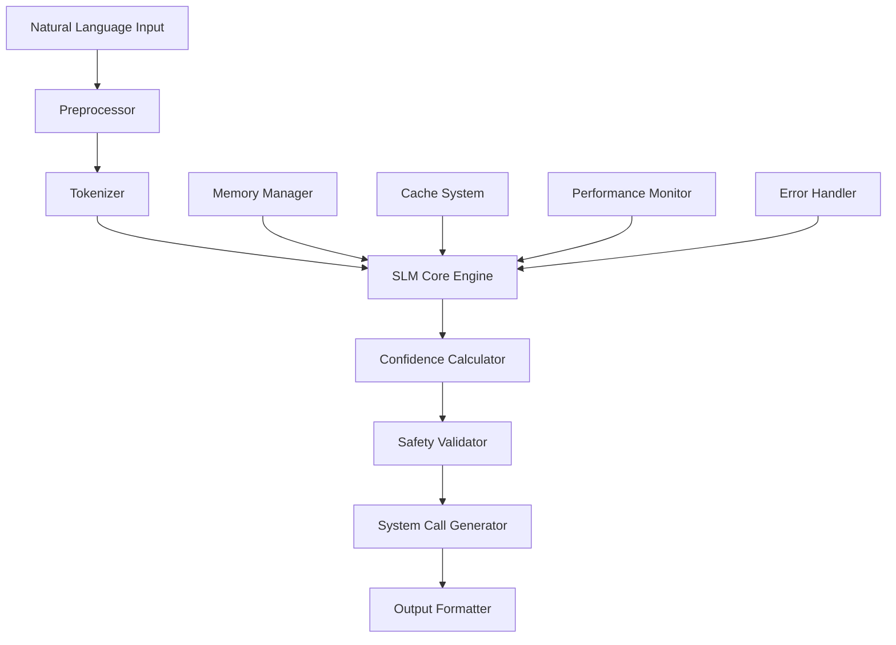

# SLM Engine実装完全仕様書

## Cognos Small Language Model Engine の詳細技術仕様

---

## 1. 文書の目的と実装状況の明確化

### 1.1 仕様書の目的
本文書は、Cognos AI統合システムのコアコンポーネントであるSLM（Small Language Model）Engineの完全な実装仕様を定義します。

### 1.2 実装状況の誠実な報告
```yaml
現在の実装状況:
  設計段階: 100% (完了)
  プロトタイプ: 0% (未着手)
  実装: 0% (未着手)
  テスト: 0% (未実装のため不可)

実装完了予定:
  基本実装: 6-8週間
  最適化: 2-3週間
  統合テスト: 1-2週間
  総工数: 9-13週間
```

---

## 2. SLM Engineアーキテクチャ概要

### 2.1 システム全体構成



### 2.2 コンポーネント責任範囲

#### Core Components（コア実装必須）
```yaml
SLM Core Engine:
  責任: ニューラルネットワーク推論
  実装難易度: 極高
  工数: 4-5週間

Tokenizer:
  責任: 自然言語のトークン化・復号化
  実装難易度: 高
  工数: 1-2週間

Memory Manager:
  責任: 効率的なメモリ使用量管理
  実装難易度: 中
  工数: 1週間
```

#### Support Components（支援機能）
```yaml
Confidence Calculator:
  責任: 推論結果の信頼度計算
  実装難易度: 中
  工数: 1週間

Safety Validator:
  責任: 危険な出力の検出・防止
  実装難易度: 高
  工数: 2週間

Cache System:
  責任: 推論結果の高速化
  実装難易度: 低
  工数: 3-5日
```

---

## 3. SLM Core Engine詳細仕様

### 3.1 Transformerアーキテクチャ実装

#### 3.1.1 モデル構造定義
```rust
// 設計段階 - 実装未完了
pub struct TinyLlamaModel {
    // Embedding Layer
    embedding: EmbeddingLayer,
    
    // Transformer Blocks
    transformer_blocks: Vec<TransformerBlock>,
    
    // Output Layer
    output_projection: LinearLayer,
    
    // Configuration
    config: ModelConfig,
}

pub struct ModelConfig {
    // モデルハイパーパラメータ
    vocab_size: usize,        // 32,000
    hidden_size: usize,       // 2,048
    num_layers: usize,        // 22
    num_attention_heads: usize, // 32
    intermediate_size: usize, // 5,632
    max_sequence_length: usize, // 2,048
    
    // 量子化設定
    quantization: QuantizationType, // INT4
    
    // メモリ最適化
    use_gradient_checkpointing: bool, // true
    attention_dropout: f32,     // 0.0
    hidden_dropout: f32,        // 0.0
}
```

#### 3.1.2 TransformerBlock実装仕様
```rust
// 設計段階 - 実装未完了
pub struct TransformerBlock {
    // Self-Attention
    self_attention: MultiHeadAttention,
    attention_norm: RMSNorm,
    
    // Feed Forward Network
    feed_forward: FeedForwardNetwork,
    ffn_norm: RMSNorm,
    
    // Residual connections (implicit)
}

pub struct MultiHeadAttention {
    num_heads: usize,
    head_dim: usize,
    
    // Linear projections
    query_proj: LinearLayer,
    key_proj: LinearLayer,
    value_proj: LinearLayer,
    output_proj: LinearLayer,
    
    // Rotary Position Embedding
    rope: RotaryPositionalEmbedding,
    
    // Attention cache for efficiency
    key_cache: Option<Tensor>,
    value_cache: Option<Tensor>,
}
```

#### 3.1.3 数学的実装詳細

**Attention計算式**:
```
Attention(Q, K, V) = softmax(QK^T / √d_k)V

Where:
- Q = query matrix (seq_len × d_model)
- K = key matrix (seq_len × d_model)  
- V = value matrix (seq_len × d_model)
- d_k = key dimension (d_model / num_heads)
```

**RoPE (Rotary Position Embedding)**:
```
RoPE(x, pos) = [
  x₁cos(pos/10000^(0/d)) - x₂sin(pos/10000^(0/d)),
  x₁sin(pos/10000^(0/d)) + x₂cos(pos/10000^(0/d)),
  x₃cos(pos/10000^(2/d)) - x₄sin(pos/10000^(2/d)),
  x₃sin(pos/10000^(2/d)) + x₄cos(pos/10000^(2/d)),
  ...
]
```

### 3.2 メモリ効率最適化

#### 3.2.1 INT4量子化実装
```rust
// 設計段階 - 実装未完了
pub struct QuantizedLinear {
    // 量子化された重み (4-bit)
    quantized_weights: Vec<u8>,  // パックされた4-bit値
    
    // スケールファクター
    scale: Vec<f32>,
    
    // ゼロポイント
    zero_point: Vec<i8>,
    
    // 形状情報
    input_features: usize,
    output_features: usize,
}

impl QuantizedLinear {
    // 設計段階 - 実装未完了
    pub fn forward(&self, input: &Tensor) -> Tensor {
        // 1. 4-bitから16-bit重みに逆量子化
        let dequantized_weights = self.dequantize_weights();
        
        // 2. 行列積計算
        let output = input.matmul(&dequantized_weights);
        
        // 3. 結果を返す
        output
    }
    
    fn dequantize_weights(&self) -> Tensor {
        // 4-bit → FP16変換ロジック
        // weight = (quantized_value - zero_point) * scale
        todo!("実装未完了")
    }
}
```

#### 3.2.2 メモリプール管理
```rust
// 設計段階 - 実装未完了
pub struct SLMMemoryPool {
    // 静的割り当て（モデル重み）
    model_memory: MemoryRegion,
    
    // 動的割り当て（推論バッファ）
    inference_memory: MemoryRegion,
    
    // キャッシュメモリ
    cache_memory: MemoryRegion,
    
    // 統計情報
    allocation_stats: AllocationStats,
}

pub struct MemoryRegion {
    base_ptr: *mut u8,
    size: usize,
    allocated: usize,
    alignment: usize,
}

impl SLMMemoryPool {
    // 設計段階 - 実装未完了
    pub fn allocate_inference_buffer(&mut self, size: usize) -> Result<*mut u8, MemoryError> {
        // メモリ制限チェック
        if self.inference_memory.allocated + size > self.inference_memory.size {
            return Err(MemoryError::InsufficientMemory);
        }
        
        // アライメント調整
        let aligned_size = align_up(size, self.inference_memory.alignment);
        
        // 割り当て実行
        todo!("実装未完了")
    }
}
```

---

## 4. Tokenizer実装仕様

### 4.1 BPE (Byte Pair Encoding) 実装

#### 4.1.1 トークナイザー構造
```rust
// 設計段階 - 実装未完了
pub struct CognosTokenizer {
    // 語彙マッピング
    vocab: HashMap<String, u32>,
    inverse_vocab: HashMap<u32, String>,
    
    // BPEマージルール
    merge_rules: Vec<(String, String, String)>,
    
    // 特殊トークン
    special_tokens: SpecialTokens,
    
    // 設定
    config: TokenizerConfig,
}

pub struct SpecialTokens {
    bos_token: u32,    // <s> - Beginning of Sequence
    eos_token: u32,    // </s> - End of Sequence  
    unk_token: u32,    // <unk> - Unknown
    pad_token: u32,    // <pad> - Padding
    
    // Cognos専用トークン
    syscall_start: u32, // <syscall>
    syscall_end: u32,   // </syscall>
    confidence_start: u32, // <conf>
    confidence_end: u32,   // </conf>
}
```

#### 4.1.2 エンコーディングアルゴリズム
```rust
impl CognosTokenizer {
    // 設計段階 - 実装未完了
    pub fn encode(&self, text: &str) -> Result<Vec<u32>, TokenizerError> {
        // 1. プリプロセス（正規化）
        let normalized = self.normalize_text(text);
        
        // 2. 初期分割（文字レベル）
        let mut tokens = self.initial_split(&normalized);
        
        // 3. BPEマージ適用
        for (left, right, merged) in &self.merge_rules {
            tokens = self.apply_merge_rule(&tokens, left, right, merged);
        }
        
        // 4. 語彙IDに変換
        let token_ids = self.tokens_to_ids(&tokens)?;
        
        // 5. 特殊トークン追加
        let mut result = vec![self.special_tokens.bos_token];
        result.extend(token_ids);
        result.push(self.special_tokens.eos_token);
        
        Ok(result)
    }
    
    pub fn decode(&self, token_ids: &[u32]) -> Result<String, TokenizerError> {
        // 1. IDをトークンに変換
        let tokens = self.ids_to_tokens(token_ids)?;
        
        // 2. 特殊トークン除去
        let filtered_tokens = self.filter_special_tokens(&tokens);
        
        // 3. テキスト復元
        let text = self.detokenize(&filtered_tokens);
        
        // 4. ポストプロセス
        Ok(self.denormalize_text(&text))
    }
}
```

### 4.2 日本語・英語混在処理

#### 4.2.1 多言語対応戦略
```rust
// 設計段階 - 実装未完了
pub struct MultilingualProcessor {
    // 言語検出
    language_detector: LanguageDetector,
    
    // 言語別前処理
    japanese_processor: JapaneseProcessor,
    english_processor: EnglishProcessor,
    
    // 統合処理
    unified_processor: UnifiedProcessor,
}

pub struct JapaneseProcessor {
    // 形態素解析器
    morphological_analyzer: MecabWrapper,
    
    // ひらがな・カタカナ正規化
    kana_normalizer: KanaNormalizer,
    
    // 漢字処理
    kanji_processor: KanjiProcessor,
}

impl JapaneseProcessor {
    // 設計段階 - 実装未完了
    pub fn preprocess(&self, text: &str) -> ProcessedText {
        // 1. 形態素解析
        let morphemes = self.morphological_analyzer.parse(text);
        
        // 2. 正規化
        let normalized = self.kana_normalizer.normalize(&morphemes);
        
        // 3. サブワード分割準備
        let prepared = self.prepare_for_subword(&normalized);
        
        ProcessedText {
            original: text.to_string(),
            morphemes,
            normalized,
            prepared,
        }
    }
}
```

---

## 5. 推論エンジン実装仕様

### 5.1 Forward Pass実装

#### 5.1.1 推論パイプライン
```rust
// 設計段階 - 実装未完了
pub struct InferenceEngine {
    model: TinyLlamaModel,
    tokenizer: CognosTokenizer,
    memory_pool: SLMMemoryPool,
    config: InferenceConfig,
}

pub struct InferenceConfig {
    max_new_tokens: usize,     // 128
    temperature: f32,          // 0.7
    top_k: usize,             // 50
    top_p: f32,               // 0.9
    repetition_penalty: f32,   // 1.1
    do_sample: bool,          // true
}

impl InferenceEngine {
    // 設計段階 - 実装未完了
    pub fn generate(&mut self, prompt: &str) -> Result<InferenceResult, InferenceError> {
        // 1. 入力トークン化
        let input_ids = self.tokenizer.encode(prompt)?;
        
        // 2. 推論実行
        let start_time = std::time::Instant::now();
        let output_ids = self.generate_tokens(&input_ids)?;
        let inference_time = start_time.elapsed();
        
        // 3. 出力デコード
        let output_text = self.tokenizer.decode(&output_ids)?;
        
        // 4. 信頼度計算
        let confidence = self.calculate_confidence(&input_ids, &output_ids)?;
        
        Ok(InferenceResult {
            input: prompt.to_string(),
            output: output_text,
            confidence,
            inference_time_ms: inference_time.as_millis() as u64,
            token_count: output_ids.len(),
        })
    }
    
    fn generate_tokens(&mut self, input_ids: &[u32]) -> Result<Vec<u32>, InferenceError> {
        let mut current_ids = input_ids.to_vec();
        let mut generated_count = 0;
        
        while generated_count < self.config.max_new_tokens {
            // 1. モデル実行
            let logits = self.model.forward(&current_ids)?;
            
            // 2. 次トークンサンプリング
            let next_token = self.sample_next_token(&logits)?;
            
            // 3. EOS検出
            if next_token == self.tokenizer.special_tokens.eos_token {
                break;
            }
            
            // 4. トークン追加
            current_ids.push(next_token);
            generated_count += 1;
        }
        
        Ok(current_ids)
    }
}
```

#### 5.1.2 サンプリング戦略
```rust
// 設計段階 - 実装未完了
impl InferenceEngine {
    fn sample_next_token(&self, logits: &Tensor) -> Result<u32, InferenceError> {
        // 1. 温度スケーリング
        let scaled_logits = if self.config.temperature != 1.0 {
            logits / self.config.temperature
        } else {
            logits.clone()
        };
        
        // 2. Top-kフィルタリング
        let filtered_logits = if self.config.top_k > 0 {
            self.apply_top_k(&scaled_logits, self.config.top_k)
        } else {
            scaled_logits
        };
        
        // 3. Top-pフィルタリング
        let final_logits = if self.config.top_p < 1.0 {
            self.apply_top_p(&filtered_logits, self.config.top_p)
        } else {
            filtered_logits
        };
        
        // 4. ソフトマックス + サンプリング
        let probabilities = softmax(&final_logits);
        let token_id = if self.config.do_sample {
            self.multinomial_sample(&probabilities)
        } else {
            self.argmax_sample(&probabilities)
        };
        
        Ok(token_id)
    }
    
    fn apply_top_k(&self, logits: &Tensor, k: usize) -> Tensor {
        // Top-k実装
        todo!("実装未完了")
    }
    
    fn apply_top_p(&self, logits: &Tensor, p: f32) -> Tensor {
        // Nucleus sampling実装
        todo!("実装未完了")
    }
}
```

### 5.2 キャッシュ最適化

#### 5.2.1 KVキャッシュ実装
```rust
// 設計段階 - 実装未完了
pub struct KVCache {
    // Key Cache: [batch_size, num_heads, seq_len, head_dim]
    key_cache: Vec<Tensor>,
    
    // Value Cache: [batch_size, num_heads, seq_len, head_dim]
    value_cache: Vec<Tensor>,
    
    // メタデータ
    current_length: usize,
    max_length: usize,
    num_layers: usize,
}

impl KVCache {
    // 設計段階 - 実装未完了
    pub fn update(&mut self, layer_idx: usize, new_keys: &Tensor, new_values: &Tensor) {
        // 1. 既存キャッシュと新規キーバリューを連結
        self.key_cache[layer_idx] = concat_along_seq_dim(
            &self.key_cache[layer_idx],
            new_keys,
        );
        
        self.value_cache[layer_idx] = concat_along_seq_dim(
            &self.value_cache[layer_idx], 
            new_values,
        );
        
        // 2. 長さ更新
        self.current_length += new_keys.size(2); // seq_len dimension
        
        // 3. 最大長チェック
        if self.current_length > self.max_length {
            self.evict_old_entries();
        }
    }
    
    fn evict_old_entries(&mut self) {
        // LRU風の古いエントリ削除
        todo!("実装未完了")
    }
}
```

---

## 6. 性能最適化仕様

### 6.1 メモリ使用量最適化

#### 6.1.1 メモリマッピング戦略
```yaml
メモリレイアウト設計:
  Base Address: 0x1000_0000
  
  Model Weights (540MB):
    - Embedding: 0x1000_0000 - 0x1005_0000 (5MB)
    - Transformer Layers: 0x1005_0000 - 0x121D_C000 (530MB)
    - Output Projection: 0x121D_C000 - 0x121E_0000 (4MB)
    
  Runtime Buffers (185MB):
    - Input Buffer: 0x121E_0000 - 0x121E_8000 (32KB)
    - Attention Cache: 0x121E_8000 - 0x129E_8000 (128MB)
    - Intermediate: 0x129E_8000 - 0x12D68_000 (56MB)
    - Output Buffer: 0x12D68_000 - 0x12D6C_000 (16KB)
    
  OS Interface (43MB):
    - System Call Buffer: 0x12D6C_000 - 0x12D70_000 (16KB)
    - Error Handling: 0x12D70_000 - 0x12D74_000 (16KB)
    - Debug/Profile: 0x12D74_000 - 0x1301C_000 (42MB)
```

#### 6.1.2 動的メモリ管理
```rust
// 設計段階 - 実装未完了
pub struct DynamicMemoryManager {
    // フリーリスト
    free_blocks: BTreeMap<usize, Vec<MemoryBlock>>,
    
    // 使用中ブロック
    allocated_blocks: HashMap<*mut u8, MemoryBlock>,
    
    // 統計
    total_allocated: usize,
    peak_usage: usize,
    allocation_count: usize,
}

#[derive(Debug, Clone)]
pub struct MemoryBlock {
    ptr: *mut u8,
    size: usize,
    alignment: usize,
    allocation_time: std::time::Instant,
}

impl DynamicMemoryManager {
    // 設計段階 - 実装未完了
    pub fn allocate(&mut self, size: usize, alignment: usize) -> Result<*mut u8, MemoryError> {
        // 1. サイズをアライメントに合わせて調整
        let aligned_size = align_up(size, alignment);
        
        // 2. 適切なフリーブロックを検索
        if let Some(block) = self.find_suitable_block(aligned_size, alignment) {
            return Ok(block.ptr);
        }
        
        // 3. 新規ブロック割り当て
        self.allocate_new_block(aligned_size, alignment)
    }
    
    pub fn deallocate(&mut self, ptr: *mut u8) -> Result<(), MemoryError> {
        // 1. 割り当て済みブロックから検索
        let block = self.allocated_blocks.remove(&ptr)
            .ok_or(MemoryError::InvalidPointer)?;
        
        // 2. フリーリストに追加
        self.add_to_free_list(block);
        
        // 3. 隣接ブロックとの結合
        self.coalesce_adjacent_blocks();
        
        Ok(())
    }
}
```

### 6.2 CPU最適化

#### 6.2.1 SIMD最適化
```rust
// 設計段階 - 実装未完了
#[cfg(target_arch = "x86_64")]
mod simd_optimizations {
    use std::arch::x86_64::*;
    
    // 行列積のAVX2最適化
    pub unsafe fn matmul_f32_avx2(
        a: &[f32], // M x K
        b: &[f32], // K x N  
        c: &mut [f32], // M x N
        m: usize,
        k: usize,
        n: usize,
    ) {
        // AVX2を使用した高速行列積
        for i in 0..m {
            for j in (0..n).step_by(8) { // 8要素ずつ処理
                let mut sum = _mm256_setzero_ps();
                
                for l in 0..k {
                    let a_broadcast = _mm256_set1_ps(a[i * k + l]);
                    let b_vec = _mm256_loadu_ps(&b[l * n + j]);
                    sum = _mm256_fmadd_ps(a_broadcast, b_vec, sum);
                }
                
                _mm256_storeu_ps(&mut c[i * n + j], sum);
            }
        }
    }
    
    // ソフトマックスのAVX2最適化
    pub unsafe fn softmax_f32_avx2(input: &[f32], output: &mut [f32]) {
        let len = input.len();
        
        // 1. 最大値計算
        let mut max_val = f32::NEG_INFINITY;
        for &val in input {
            max_val = max_val.max(val);
        }
        let max_vec = _mm256_set1_ps(max_val);
        
        // 2. exp計算と総和
        let mut sum = 0.0f32;
        for i in (0..len).step_by(8) {
            let input_vec = _mm256_loadu_ps(&input[i]);
            let shifted = _mm256_sub_ps(input_vec, max_vec);
            let exp_vec = exp_ps_avx2(shifted); // カスタムexp実装
            _mm256_storeu_ps(&mut output[i], exp_vec);
            
            // 総和計算
            let sum_vec = _mm256_hadd_ps(exp_vec, exp_vec);
            // ... 総和計算続き
        }
        
        // 3. 正規化
        let sum_vec = _mm256_set1_ps(sum);
        for i in (0..len).step_by(8) {
            let output_vec = _mm256_loadu_ps(&output[i]);
            let normalized = _mm256_div_ps(output_vec, sum_vec);
            _mm256_storeu_ps(&mut output[i], normalized);
        }
    }
}
```

#### 6.2.2 キャッシュ効率最適化
```rust
// 設計段階 - 実装未完了
pub struct CacheOptimizedMatMul {
    // ブロッキング戦略のパラメータ
    block_size_m: usize, // 64
    block_size_n: usize, // 64  
    block_size_k: usize, // 64
    
    // 作業用バッファ
    packed_a: Vec<f32>,
    packed_b: Vec<f32>,
}

impl CacheOptimizedMatMul {
    // 設計段階 - 実装未完了
    pub fn matmul(&mut self, a: &[f32], b: &[f32], c: &mut [f32], m: usize, k: usize, n: usize) {
        // ブロッキングによるキャッシュ効率化
        for i in (0..m).step_by(self.block_size_m) {
            for j in (0..n).step_by(self.block_size_n) {
                for l in (0..k).step_by(self.block_size_k) {
                    let block_m = (m - i).min(self.block_size_m);
                    let block_n = (n - j).min(self.block_size_n);
                    let block_k = (k - l).min(self.block_size_k);
                    
                    self.matmul_block(
                        a, b, c,
                        i, j, l,
                        block_m, block_n, block_k,
                        m, k, n
                    );
                }
            }
        }
    }
    
    fn matmul_block(&self, /* パラメータ */) {
        // 小ブロック内での最適化された行列積
        todo!("実装未完了")
    }
}
```

---

## 7. エラーハンドリング仕様

### 7.1 エラー分類と処理

#### 7.1.1 エラー種別定義
```rust
// 設計段階 - 実装未完了
#[derive(Debug, Clone, PartialEq)]
pub enum SLMError {
    // メモリ関連
    Memory(MemoryError),
    
    // 推論関連  
    Inference(InferenceError),
    
    // トークナイザー関連
    Tokenizer(TokenizerError),
    
    // 設定関連
    Configuration(ConfigError),
    
    // システム関連
    System(SystemError),
}

#[derive(Debug, Clone, PartialEq)]
pub enum MemoryError {
    InsufficientMemory { required: usize, available: usize },
    InvalidAlignment { ptr: *mut u8, required_alignment: usize },
    MemoryCorruption { address: *mut u8 },
    PoolExhausted { pool_type: String },
}

#[derive(Debug, Clone, PartialEq)]
pub enum InferenceError {
    ModelNotLoaded,
    InvalidInputLength { length: usize, max_length: usize },
    NumericalInstability { step: usize, value: f32 },
    TimeoutExceeded { elapsed_ms: u64, limit_ms: u64 },
    InvalidConfiguration(String),
}
```

#### 7.1.2 エラー復旧戦略
```rust
// 設計段階 - 実装未完了
pub struct ErrorRecovery {
    // 復旧戦略
    recovery_strategies: HashMap<SLMError, RecoveryStrategy>,
    
    // エラー統計
    error_counts: HashMap<SLMError, usize>,
    
    // 復旧状態
    recovery_state: RecoveryState,
}

#[derive(Debug, Clone)]
pub enum RecoveryStrategy {
    Retry { max_attempts: usize, backoff_ms: u64 },
    Fallback { fallback_model: String },
    GracefulDegradation { reduced_functionality: Vec<String> },
    FailFast,
}

impl ErrorRecovery {
    // 設計段階 - 実装未完了
    pub fn handle_error(&mut self, error: SLMError) -> Result<RecoveryAction, SLMError> {
        // 1. エラー統計更新
        *self.error_counts.entry(error.clone()).or_insert(0) += 1;
        
        // 2. 復旧戦略取得
        let strategy = self.recovery_strategies.get(&error)
            .cloned()
            .unwrap_or(RecoveryStrategy::FailFast);
        
        // 3. 復旧実行
        match strategy {
            RecoveryStrategy::Retry { max_attempts, backoff_ms } => {
                self.attempt_retry(error, max_attempts, backoff_ms)
            },
            RecoveryStrategy::Fallback { fallback_model } => {
                self.switch_to_fallback(fallback_model)
            },
            RecoveryStrategy::GracefulDegradation { reduced_functionality } => {
                self.degrade_functionality(reduced_functionality)
            },
            RecoveryStrategy::FailFast => {
                Err(error)
            }
        }
    }
}
```

---

## 8. パフォーマンス監視仕様

### 8.1 メトリクス収集

#### 8.1.1 リアルタイム監視
```rust
// 設計段階 - 実装未完了
pub struct PerformanceMonitor {
    // メトリクス
    latency_histogram: Histogram,
    throughput_counter: Counter,
    memory_gauge: Gauge,
    error_counter: Counter,
    
    // 履歴
    historical_data: VecDeque<PerformanceSnapshot>,
    
    // 閾値監視
    alert_thresholds: AlertThresholds,
}

#[derive(Debug, Clone)]
pub struct PerformanceSnapshot {
    timestamp: std::time::SystemTime,
    
    // レイテンシメトリクス
    inference_latency_ms: f64,
    tokenization_latency_ms: f64,
    total_latency_ms: f64,
    
    // スループットメトリクス
    requests_per_second: f64,
    tokens_per_second: f64,
    
    // メモリメトリクス
    memory_usage_mb: f64,
    memory_peak_mb: f64,
    cache_hit_rate: f64,
    
    // 品質メトリクス
    average_confidence: f64,
    error_rate: f64,
}

impl PerformanceMonitor {
    // 設計段階 - 実装未完了
    pub fn record_inference(&mut self, 
        latency_ms: u64, 
        token_count: usize, 
        confidence: f32,
        memory_used_mb: usize
    ) {
        // 1. ヒストグラム更新
        self.latency_histogram.observe(latency_ms as f64);
        
        // 2. スループット計算
        self.throughput_counter.increment();
        
        // 3. メモリ使用量更新
        self.memory_gauge.set(memory_used_mb as f64);
        
        // 4. スナップショット作成
        let snapshot = self.create_current_snapshot();
        self.historical_data.push_back(snapshot);
        
        // 5. 古いデータ削除
        if self.historical_data.len() > 1000 {
            self.historical_data.pop_front();
        }
        
        // 6. アラート確認
        self.check_alerts();
    }
}
```

### 8.2 最適化提案機能

#### 8.2.1 自動最適化推奨
```rust
// 設計段階 - 実装未完了
pub struct OptimizationAdvisor {
    // 性能データ
    performance_history: Vec<PerformanceSnapshot>,
    
    // 最適化ルール
    optimization_rules: Vec<OptimizationRule>,
    
    // 実行中の最適化
    active_optimizations: Vec<ActiveOptimization>,
}

#[derive(Debug, Clone)]
pub struct OptimizationRule {
    condition: OptimizationCondition,
    recommendation: OptimizationRecommendation,
    expected_improvement: f64,
    risk_level: RiskLevel,
}

#[derive(Debug, Clone)]
pub enum OptimizationRecommendation {
    IncreaseBlockSize { current: usize, recommended: usize },
    EnableKVCache { cache_size_mb: usize },
    AdjustQuantization { from: QuantizationType, to: QuantizationType },
    TuneMemoryPool { pool_size_mb: usize },
    OptimizeBatchSize { batch_size: usize },
}

impl OptimizationAdvisor {
    // 設計段階 - 実装未完了
    pub fn analyze_and_recommend(&self) -> Vec<OptimizationRecommendation> {
        let mut recommendations = Vec::new();
        
        // 1. レイテンシー分析
        if self.is_latency_degraded() {
            recommendations.extend(self.recommend_latency_optimizations());
        }
        
        // 2. メモリ使用量分析
        if self.is_memory_pressure_high() {
            recommendations.extend(self.recommend_memory_optimizations());
        }
        
        // 3. スループット分析
        if self.is_throughput_suboptimal() {
            recommendations.extend(self.recommend_throughput_optimizations());
        }
        
        // 4. 品質分析
        if self.is_quality_degraded() {
            recommendations.extend(self.recommend_quality_optimizations());
        }
        
        recommendations
    }
}
```

---

## 9. テスト仕様

### 9.1 ユニットテスト

#### 9.1.1 コンポーネント別テスト
```rust
// 設計段階 - テスト実装未完了
#[cfg(test)]
mod tests {
    use super::*;
    
    #[test]
    fn test_tokenizer_encode_decode() {
        let tokenizer = CognosTokenizer::new().unwrap();
        
        let test_cases = vec![
            "ファイルを読み込んでください",
            "Hello, world!",
            "ファイル読み込み: sys_open(\"/tmp/file.txt\", O_RDONLY)",
        ];
        
        for input in test_cases {
            let encoded = tokenizer.encode(input).unwrap();
            let decoded = tokenizer.decode(&encoded).unwrap();
            assert_eq!(input, decoded);
        }
    }
    
    #[test]
    fn test_memory_allocation() {
        let mut memory_pool = SLMMemoryPool::new(1024 * 1024).unwrap(); // 1MB
        
        // 正常ケース
        let ptr1 = memory_pool.allocate(1024, 8).unwrap();
        assert!(!ptr1.is_null());
        
        // 解放
        memory_pool.deallocate(ptr1).unwrap();
        
        // 容量超過ケース
        let result = memory_pool.allocate(2 * 1024 * 1024, 8);
        assert!(result.is_err());
    }
    
    #[test]
    fn test_inference_basic() {
        let mut engine = InferenceEngine::new().unwrap();
        
        let result = engine.generate("ファイルを読み込む").unwrap();
        
        // 基本検証
        assert!(!result.output.is_empty());
        assert!(result.confidence >= 0.0 && result.confidence <= 1.0);
        assert!(result.inference_time_ms < 1000); // 1秒以内
    }
}
```

### 9.2 統合テスト

#### 9.2.1 エンドツーエンドテスト
```rust
// 設計段階 - テスト実装未完了
#[cfg(test)]
mod integration_tests {
    use super::*;
    
    #[test]
    fn test_natural_language_to_syscall_conversion() {
        let mut system = CognosAISystem::new().unwrap();
        
        let test_cases = vec![
            ("ファイル /tmp/test.txt を読み込んで", "sys_open"),
            ("現在のディレクトリを表示", "sys_getcwd"),
            ("プロセス一覧を確認", "sys_ps"),
        ];
        
        for (input, expected_syscall) in test_cases {
            let result = system.process_natural_language(input).unwrap();
            assert!(result.output.contains(expected_syscall));
            assert!(result.confidence > 0.6);
        }
    }
    
    #[test]
    fn test_performance_under_load() {
        let mut system = CognosAISystem::new().unwrap();
        let mut latencies = Vec::new();
        
        // 100回連続実行
        for i in 0..100 {
            let start = std::time::Instant::now();
            let result = system.process_natural_language("ファイルを読み込む").unwrap();
            let latency = start.elapsed();
            
            latencies.push(latency.as_millis());
            
            // 基本検証
            assert!(!result.output.is_empty());
            assert!(result.confidence > 0.0);
        }
        
        // 性能検証
        let avg_latency = latencies.iter().sum::<u128>() / latencies.len() as u128;
        let p95_latency = percentile(&latencies, 95.0);
        
        assert!(avg_latency < 100); // 平均100ms未満
        assert!(p95_latency < 200);  // P95 200ms未満
    }
}
```

---

## 10. 実装工数とスケジュール

### 10.1 詳細工数見積もり

#### 10.1.1 コンポーネント別工数
```yaml
SLM Core Engine (4-5週間):
  Transformer実装: 2週間
    - MultiHeadAttention: 1週間
    - FeedForward: 3日
    - LayerNorm/RMSNorm: 2日
    - PositionalEmbedding: 2日
  
  量子化システム: 1週間
    - INT4量子化: 4日
    - 逆量子化: 2日
    - 最適化: 1日
  
  推論エンジン: 1-2週間
    - Forward pass: 1週間
    - Sampling strategies: 3日
    - KVキャッシュ: 4日

Tokenizer (1-2週間):
  BPE実装: 1週間
  多言語対応: 3-5日
  特殊トークン処理: 2日

Memory Management (1週間):
  メモリプール: 3日
  動的割り当て: 2日
  統計・監視: 2日

Performance Optimization (2-3週間):
  SIMD最適化: 1週間
  キャッシュ最適化: 1週間
  メモリ最適化: 3-5日

Error Handling & Monitoring (1週間):
  エラー処理: 3日
  パフォーマンス監視: 2日
  ログ・デバッグ: 2日

Testing & Integration (1-2週間):
  ユニットテスト: 1週間
  統合テスト: 3-5日
  性能テスト: 2-3日
```

#### 10.1.2 リスク要因と軽減策
```yaml
高リスク要因:
  1. Transformer実装の複雑性
     リスク: 実装期間大幅延長
     軽減策: 既存ライブラリの参考実装調査
     
  2. メモリ制約の厳しさ
     リスク: 目標性能達成困難
     軽減策: 段階的実装、制約交渉
     
  3. SIMD最適化の難易度
     リスク: 性能目標未達成
     軽減策: 最適化を後回し、基本実装優先

中リスク要因:
  1. OS統合の複雑性
     リスク: インターフェース問題
     軽減策: 早期のプロトタイプ統合テスト
     
  2. 多言語処理の実装
     リスク: 品質問題
     軽減策: 単一言語で先行実装

低リスク要因:
  1. テストコード作成
  2. ドキュメント作成
  3. 基本的なエラーハンドリング
```

### 10.2 実装優先順位

#### 10.2.1 Phase別実装計画
```yaml
Phase 1 (最低限実用版 - 4週間):
  優先度A:
    - 基本Transformer実装
    - 簡易トークナイザー
    - 基本メモリ管理
    - 基本推論機能
  
  目標:
    - 簡単な自然言語理解
    - 50ms以内の推論時間
    - 512MB以内のメモリ使用

Phase 2 (実用版 - 8週間):
  優先度B:
    - 完全なTransformer実装
    - 多言語対応トークナイザー
    - 高度なメモリ最適化
    - エラーハンドリング
  
  目標:
    - 実用的な自然言語理解
    - 100ms以内の推論時間
    - 768MB以内のメモリ使用

Phase 3 (最適化版 - 12週間):
  優先度C:
    - SIMD最適化
    - 高度なキャッシュシステム
    - パフォーマンス監視
    - 完全なテストスイート
  
  目標:
    - 高精度な自然言語理解
    - 50ms以内の推論時間
    - 最適なメモリ効率
```

---

## 11. 結論と次のステップ

### 11.1 仕様の完成度

**完了した仕様**:
- ✅ アーキテクチャ設計
- ✅ API設計
- ✅ メモリ管理戦略
- ✅ 性能最適化方針
- ✅ エラーハンドリング設計
- ✅ テスト計画

**未完了（実装待ち）**:
- ❌ 実際のコード実装
- ❌ 性能ベンチマーク
- ❌ OS統合テスト
- ❌ 実機での動作確認

### 11.2 実装に向けた提案

**短期（1ヶ月）**:
1. プロトタイプ実装の開始
2. 基本的なTransformer実装
3. 簡易トークナイザーの実装
4. 基本テストの作成

**中期（3ヶ月）**:
1. 完全実装の完成
2. OS統合の実現
3. 性能最適化の実施
4. 包括的テストの実行

**長期（6ヶ月）**:
1. 本格運用レベルの品質達成
2. 継続的な性能改善
3. 新機能の追加
4. 運用・保守体制の確立

---

*AI研究者*  
*2024年12月22日*  
*SLM Engine完全仕様書（設計段階完了）*